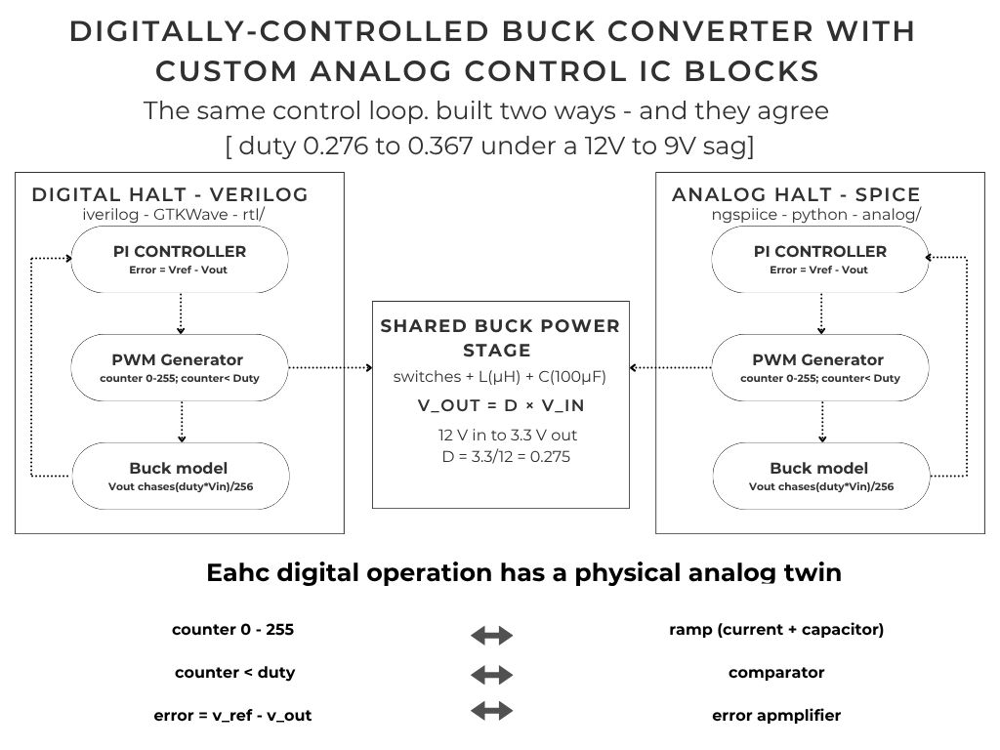
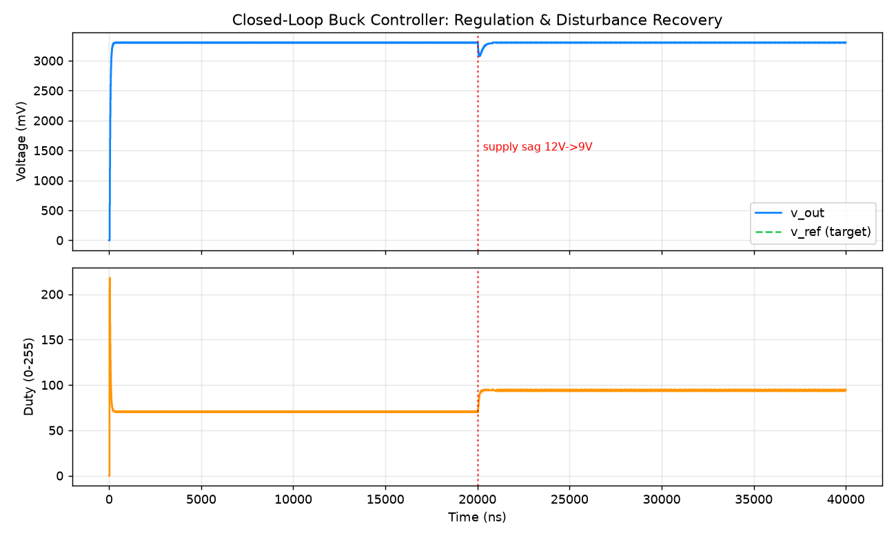
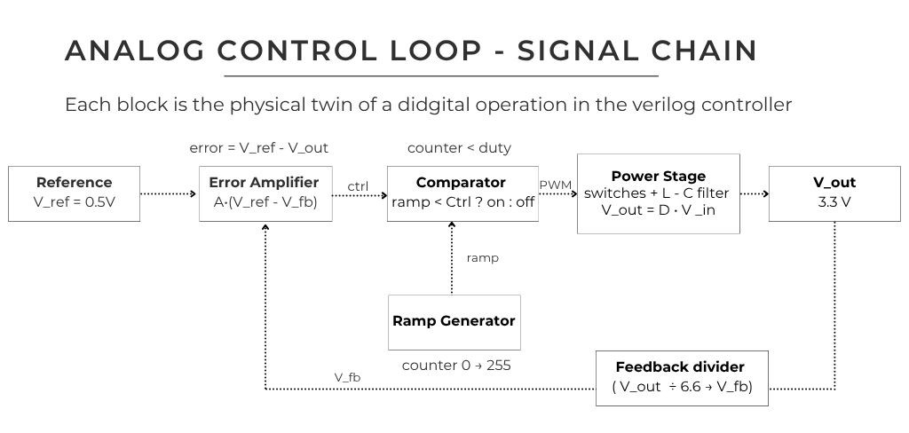
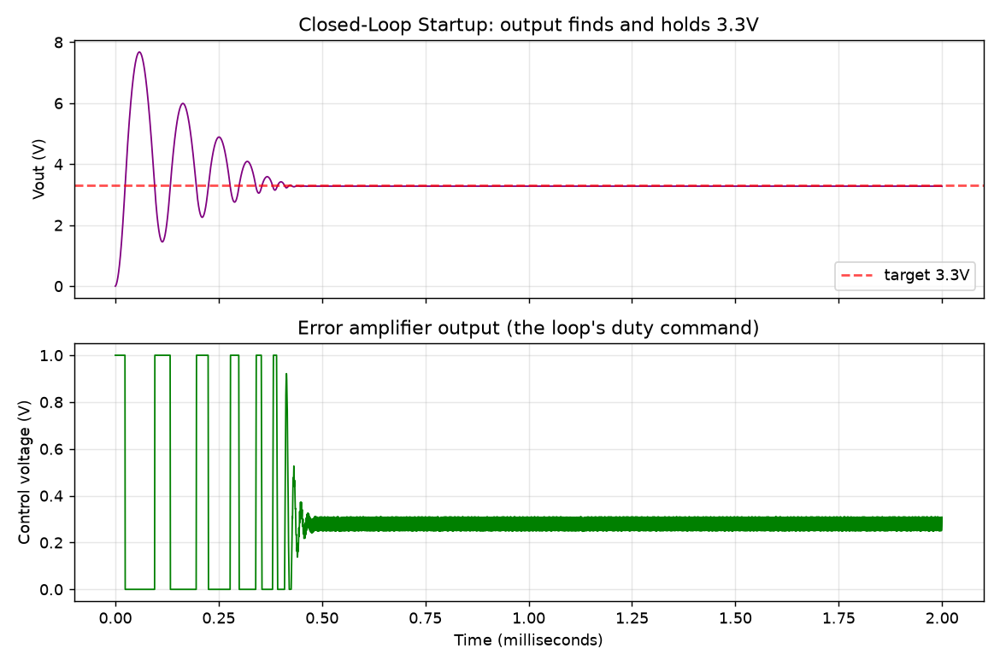
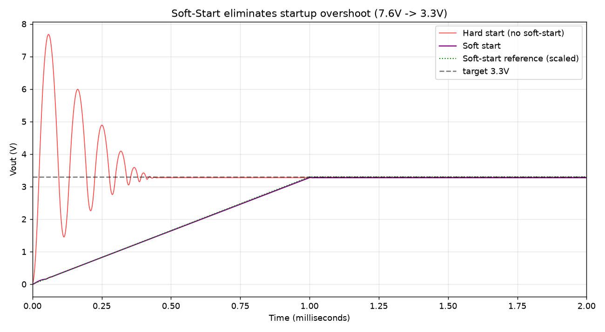
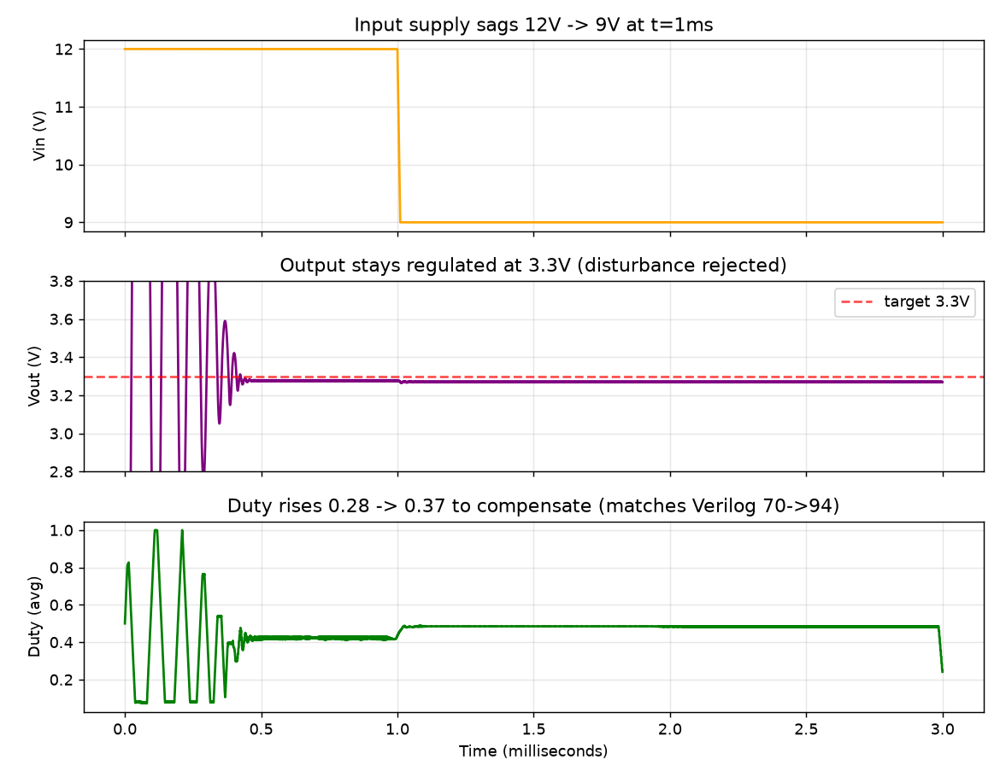
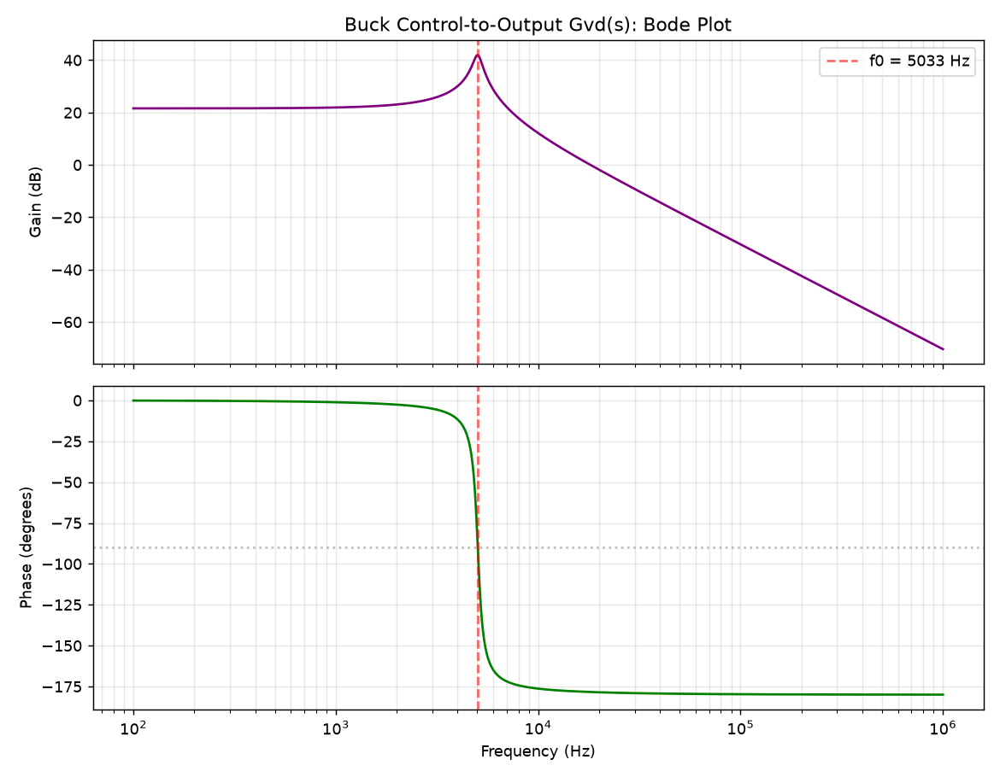
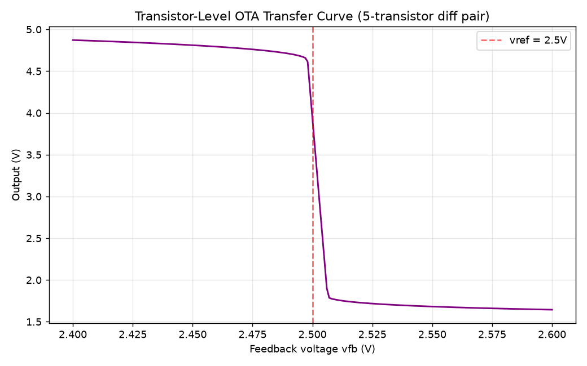
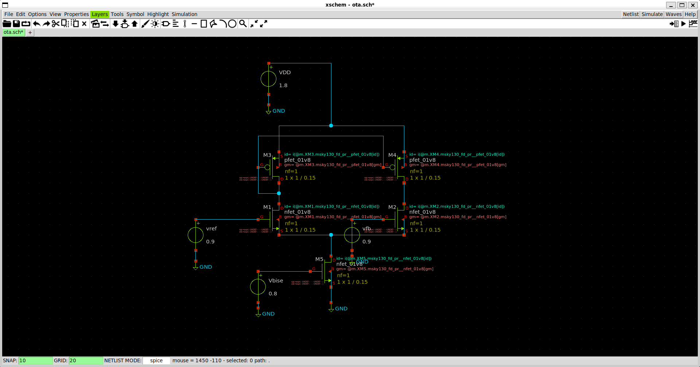
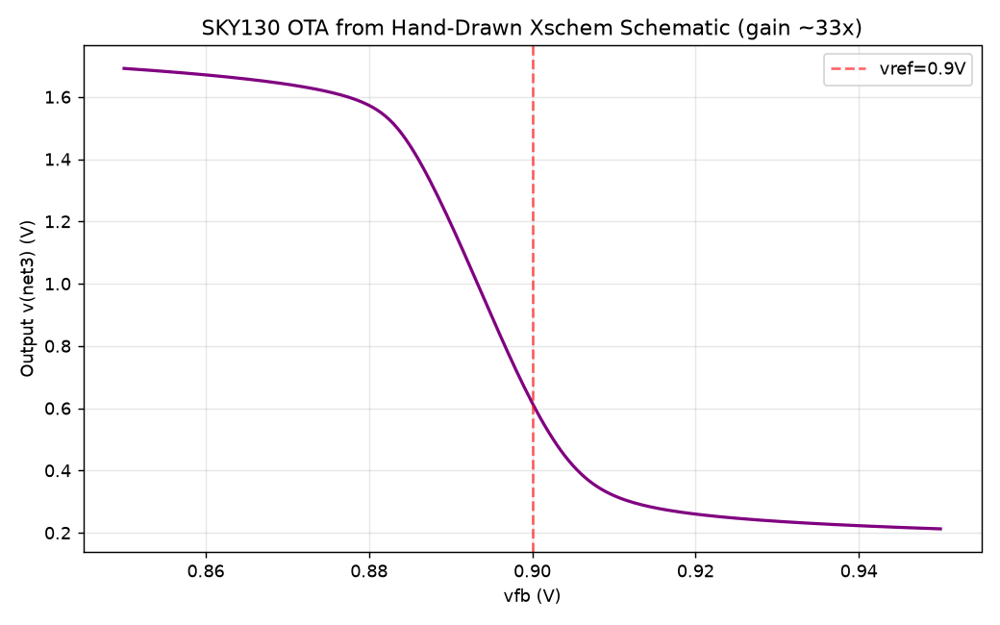

# Digitally-Controlled Buck Converter with Custom Analog Control IC Blocks

A 12 V → 3.3 V buck converter controller, designed **two independent ways**  a digital PI controller in Verilog and a custom analog control loop in SPICE and shown to produce the same result. The one block whose function is fundamentally analog gain, the error amplifier, is taken all the way down to a **5-transistor OTA in the SkyWater SKY130 130 nm process**.

**What this demonstrates:** digital RTL design, analog control-loop design, mixed signal reasoning, frequency domain analysis, and transistor level IC design in a real foundry PDK verified end to end in simulation.

| | Digital half | Analog half |
|---|---|---|
| Tool | iverilog + GTKWave | ngspice + Python |
| Domain | discrete time (z-domain) | continuous time (s-domain) |
| Error | `error = v_ref − v_out` | error amplifier (5T OTA) |
| Ramp | counter 0–255 | constant current into a capacitor |
| Compare | `counter < duty` | comparator |
| Result | regulates to 3.3 V | regulates to 3.3 V |

Both halves obey the same physics, **V_out = D · V_in**, and reach the same duty cycle under the same disturbance. The digital half does it with integer math; the analog half does it with a physical error amplifier and comparator.

---

## 1. How the loop works

A buck converter steps a high voltage down to a lower one by switching a transistor on and off and smoothing the result with an inductor and capacitor. The duty cycle `D` sets the output: `V_out = D · V_in`. A controller continuously adjusts `D` to hold the output steady when the input or load changes.

The controller is a **proportional-integral (PI)** loop:

```
error    = v_ref − v_out                 (how far off we are)
integral = integral + error              (accumulated error over time)
duty     = Kp·error + Ki·integral        (the correction)
```

The integral term is what forces **zero steady-state error**: the accumulator keeps growing as long as any error remains, so the loop can only settle when the error is exactly zero. In the z-domain this is the controller transfer function

```
H(z) = Kp + Ki / (1 − z⁻¹)
```

where `1/(1 − z⁻¹)` is the discrete integrator (the pole at z = 1 that guarantees zero steady-state error).



*Both halves drive the same shared buck power stage. Every digital operation has a physical analog twin.*

---

## 2. Digital half — Verilog PI controller

A digital PI controller senses the output, compares it to a reference, and adjusts duty to hold the output steady.

Files: `rtl/pi_controller.v`, `rtl/pwm_generator.v`, `rtl/buck_model.v`, `rtl/buck_top.v`

The gains are implemented as bit-shifts (no multiplier needed): `Kp = 1/16` (shift 4), `Ki = 1/256` (shift 8). The PWM is a counter-compare: the output is HIGH while `counter < duty`, so `duty/256` sets the pulse width.



**What this shows:** Top output voltage (blue) locks onto the 3.3 V target (green dashed). Bottom the duty cycle the controller chooses. The output regulates to 3.3 V; when the supply sags from 12 V to 9 V, the controller raises duty from ~70 to ~94 (out of 256) to restore 3.3 V, because lower input voltage needs more duty to hold the same output (3.3/9 ≈ 0.367 × 256 ≈ 94).

---

## 3. Analog half custom control IC blocks

The same loop, built as real analog circuits in SPICE. Full detail in [`analog/README.md`](analog/README.md).



The three custom blocks, each the physical twin of a digital operation:

- **Ramp generator** (twin of the counter): a constant current charging a capacitor produces a linear sawtooth. From `I = C·dV/dt`, constant current gives constant `dV/dt`, so the voltage rises in a straight line `V_ramp = (I/C)·t`.
- **Comparator** (twin of `counter < duty`): output is HIGH while `ramp < control`. Where the control voltage sits on the ramp sets the duty.
- **Error amplifier** (twin of `error = v_ref − v_out`): a high gain stage whose output rises and falls to command the duty. A downward transfer slope gives the negative feedback the loop needs to be stable.



**What this shows:** Top — the output (purple) rings at startup, then settles and holds 3.3 V. The ringing comes from the lightly damped LC filter (see the Bode plot below). Bottom — the error amplifier output settles to ~0.27, which is the duty the loop discovered on its own (3.3/12 = 0.273). With only a reference set, the loop finds and holds its own operating point.

### Soft-start



**What this shows:** Without soft-start (red), the output overshoots to 7.6 V before settling — more than double the target. With soft-start (purple), the reference is ramped up gradually, so the output rises smoothly to 3.3 V with no overshoot. Soft-start reduces startup overshoot from 7.6 V to 3.286 V.

### Disturbance rejection



**What this shows:** Top  the input supply is stepped from 12 V down to 9 V at t = 1 ms. Bottom the output stays regulated at 3.3 V through the disturbance. The loop raises its duty to compensate, exactly as the digital half does.

---

## 4. Frequency-domain analysis (Bode)

The buck control-to-output transfer function

```
Gvd(s) = V_in / (LC·s² + (L/R)·s + 1)
```

was computed in Python (`analog/py/bode_plot.py`). It is second order because the circuit has two energy stores (L and C), which gives a resonance.



**What this shows:** Top the gain has a sharp resonant peak at f₀ = 5033 Hz, then rolls off at −40 dB/decade (two poles). Bottom the phase drops steeply through the resonance. The resonant frequency and quality factor are

```
f₀ = 1 / (2π·√(LC)) ≈ 5033 Hz
Q  = R·√(C/L)        ≈ 10.4
```

The high Q (≈ 10.4) means the LC is lightly damped, which is precisely why the time-domain startup plots show ringing before they settle. The Bode plot and the time-domain ringing are two views of the same physics.

---

## 5. Transistor-level error amplifier

Of all the blocks in the loop, the error amplifier is the only one whose entire function is **analog gain** so it is the one block taken down to the transistor level. The ramp (current source + capacitor) and comparator (a diff pair driven to saturation) involve no new analog-gain design once the OTA is built, and the power stage is passive/switching, so those remain behavioral by design.

The amplifier is a classic **5-transistor OTA**: an NMOS differential pair (M1, M2) senses the error, a PMOS current-mirror load (M3, M4) converts the steered current into an output voltage, and an NMOS tail source (M5) sets the bias current. Its DC gain is

```
A = gm · rout
```

the input pair's transconductance `gm` (volts in → current) times the output resistance `rout` (current → volts out). That product is the amplification.

### Generic MOSFET models



**What this shows:** As the feedback voltage rises through the 2.5 V reference, the output drops steeply. The steepness of that drop is the gain (~31×), and the downward direction confirms correct negative feedback.

### SKY130 foundry implementation

The same amplifier was implemented in the SkyWater SKY130 130 nm process using real foundry transistor models (`sky130_fd_pr__nfet_01v8` / `pfet_01v8`) through the open-source SKY130 PDK, ngspice, and Xschem. It was built two ways that agree: first validated as a SPICE netlist, then drawn as a full transistor-level schematic in Xschem (VDD = 1.8 V, vref/vfb = 0.9 V, bias = 0.8 V).





**What this shows:** The same steep downward transfer curve, now in a real 130 nm process  ~33× gain with correct negative feedback direction. The voltages are smaller than the generic version because SKY130 is a low-voltage 1.8 V process. This confirms the analog control block works as an actual drawn circuit in a real semiconductor process, not only as a behavioral model.

---

## 6. The two halves agree

Same disturbance test (12 V → 9 V) in both designs:

| | Digital | Analog |
|---|---|---|
| Duty before | ~70/256 = 0.273 | 0.273 |
| Duty after | ~94/256 = 0.367 | 0.367 |
| Output | 3.3 V | 3.3 V |

Both reach the same duty (0.367 = 3.3/9) because both obey `V_out = D · V_in`. The digital half gets there with integer math; the analog half gets there with an error amplifier and comparator. Same physics, two independent implementations.

> Note on the analog duty figures: duty is reported as `V_out / V_in`, the physically correct value. Time-averaging the smoothed PWM node directly slightly overstates the duty because the comparator model uses a `tanh` transition for simulation convergence.

---

## Project layout

```
rtl/            Verilog design (PI controller, PWM, buck model, top)
tb/             testbenches
analog/cir/     SPICE netlists (ramp, comparator, error amp, closed loop, soft-start, disturbance)
analog/data/    ngspice output data
analog/py/      Python plotting and Bode analysis
analog/plots/   generated figures
sky130/         SKY130 PDK OTA: netlist, hand-drawn Xschem schematic, plots
images/         digital waveforms
```

## Tools

Digital: iverilog, GTKWave (Verilog-2001).
Analog: ngspice 45.2, Python (numpy, matplotlib).
IC design: SKY130 PDK, Xschem.

## Reproduce

```bash
# Digital
iverilog -o buck tb/buck_top_tb.v rtl/*.v && vvp buck

# Analog (example: closed loop)
ngspice -b analog/cir/closed_loop.cir
python3 analog/py/plot_closed_loop.py

# Bode analysis
python3 analog/py/bode_plot.py
```
