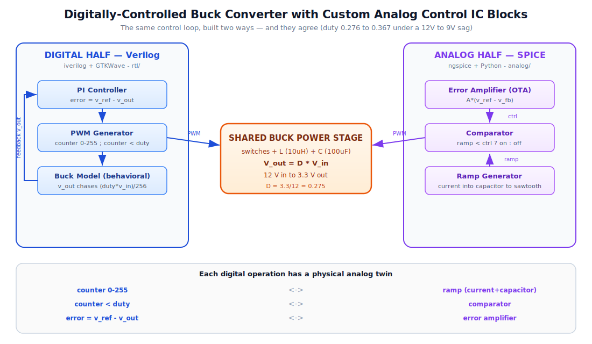
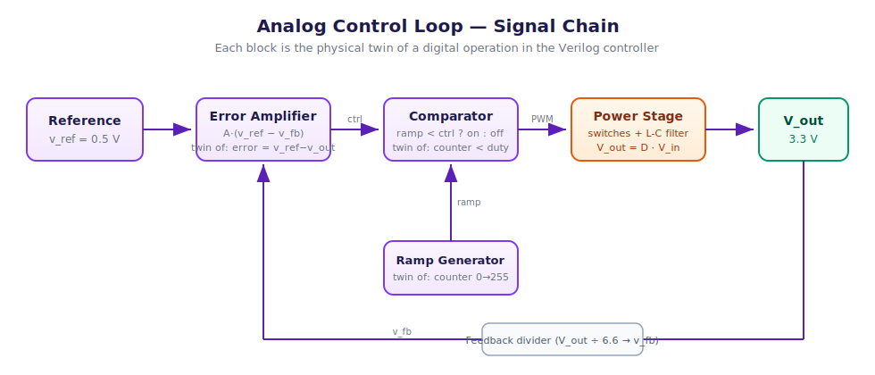

# Digitally-Controlled Buck Converter with Custom Analog Control IC Blocks

A buck converter steps a high voltage down to a lower one (here 12 V to 3.3 V) by switching a transistor on and off and smoothing with an inductor and capacitor. The duty cycle D sets the output: V_out = D * V_in. The converter needs a controller to hold the output steady when input or load changes.

This project builds that controller TWO WAYS:
1. A DIGITAL controller in Verilog — see rtl/
2. ANALOG control IC blocks in SPICE — see analog/

Same converter, same 3.3 V target, same physics V_out = D * V_in — one from digital logic, one from analog circuits.

## Full system block diagram

## The two halves at a glance

| | Digital (Verilog) | Analog (SPICE) |
|---|---|---|
| Tool | iverilog + GTKWave | ngspice + Python |
| Ramp | counter 0-255 | current into capacitor |
| Compare | counter < duty | comparator |
| Error | error = v_ref - v_out | error amplifier |
| Output | 3.3 V | 3.3 V |

Each line of the digital controller has a physical analog twin: the counter becomes a ramp, the < becomes a comparator, the subtract becomes an error amplifier.

## Digital half — Verilog controller

A digital PI controller senses the output, compares it to a reference, and adjusts duty to hold the output steady. Files: rtl/pi_controller.v, rtl/pwm_generator.v, rtl/buck_model.v, rtl/buck_top.v

Result: output settles to 3.3 V; when supply sags 12 V to 9 V, duty rises from ~70 to ~94 of 256, restoring 3.3 V.

## Analog half — custom control IC blocks

The same loop built as real analog circuits. Full detail in analog/README.md.

- Ramp generator (twin of counter): current into a capacitor makes a sawtooth.
- Comparator (twin of counter < duty): PWM HIGH while ramp < control.
- Error amplifier (twin of error = v_ref - v_out): 10 mV swings full range; downward slope gives stable negative feedback.
- Closed loop: with only a reference set, the loop finds its own duty and holds 3.277 V.

Soft-start cuts startup overshoot from 7.6 V to 3.286 V.

## The punchline: both halves agree

Same disturbance test (12 V to 9 V) in both designs:

| | Digital | Analog |
|---|---|---|
| Duty before | ~70/256 = 0.273 | 0.276 |
| Duty after | ~94/256 = 0.367 | 0.367 |
| Output | 3.3 V | 3.3 V |

Both reached the SAME duty (0.367 = 3.3/9) because both obey V_out = D * V_in. Digital did it with integer math; analog did it with an error amplifier and comparator. Same physics, different mechanisms.

## Project layout

rtl/ Verilog design. tb/ testbenches. sim/ vcd output. images/ digital waveform. analog/ SPICE blocks. README.md original digital readme. PROJECT_README.md this file.

## Tools
Digital: iverilog, GTKWave, Verilog-2001. Analog: ngspice 45.2, Python (numpy, matplotlib).

## Frequency-domain analysis (Bode)

The control-to-output transfer function Gvd(s) = Vin / (LC s^2 + (L/R)s + 1) was computed in Python. LC resonance f0 = 5033 Hz, quality factor Q = 10.4. The sharp resonant peak and steep phase drop explain the startup ringing seen in the time-domain plots.

## Transistor-level error amplifier

The behavioral error amplifier was also built at transistor level: a classic 5-transistor OTA (NMOS differential pair + PMOS current-mirror load + tail current source) using generic MOSFET models. Measured gain ~31x; output falls as feedback rises, giving the same negative-feedback direction as the behavioral block.

## SKY130 foundry implementation

The error amplifier was implemented in the SkyWater SKY130 130nm process using real foundry transistor models (sky130_fd_pr nfet_01v8 / pfet_01v8) through the open-source SKY130 PDK, ngspice, and Xschem.

It was built two ways that agree: first validated as a SPICE netlist, then drawn as a full transistor-level schematic in Xschem. The 5-transistor OTA (NMOS differential pair M1/M2, PMOS current-mirror load M3/M4, NMOS tail source M5; VDD=1.8V, vref/vfb=0.9V, bias=0.8V) was netlisted and simulated, giving ~33x gain with correct negative-feedback direction. This confirms the analog control block works as an actual drawn circuit in a real semiconductor process, not just behavioral models.

Hand-drawn schematic (Xschem + SKY130 PDK):

Simulated transfer curve:

## SKY130 OTA — hand-drawn schematic, simulated

The error amplifier was also drawn as a full transistor-level schematic in Xschem using the SKY130 PDK: a 5-transistor OTA (NMOS differential pair M1/M2, PMOS current-mirror load M3/M4, NMOS tail source M5) with VDD=1.8V, vref/vfb=0.9V, and a bias of 0.8V. The schematic was netlisted and simulated in ngspice with real foundry models, giving ~33x gain and correct negative-feedback direction. This confirms the analog control block works as an actual drawn circuit in a real 130nm process, not just as a netlist.

