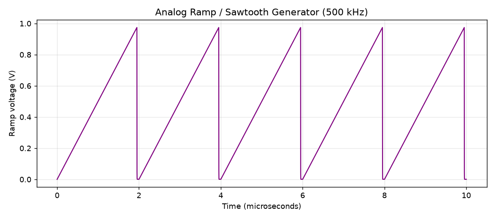
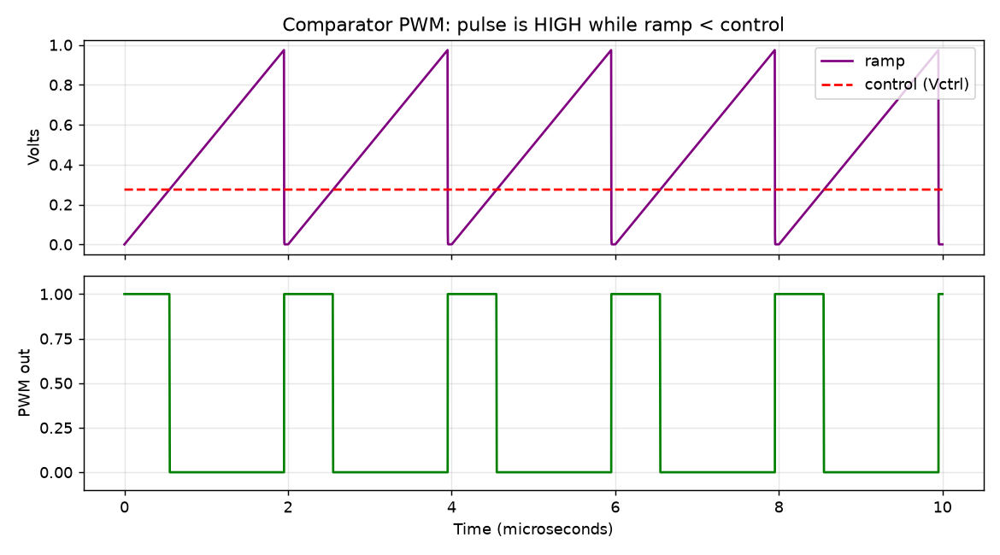
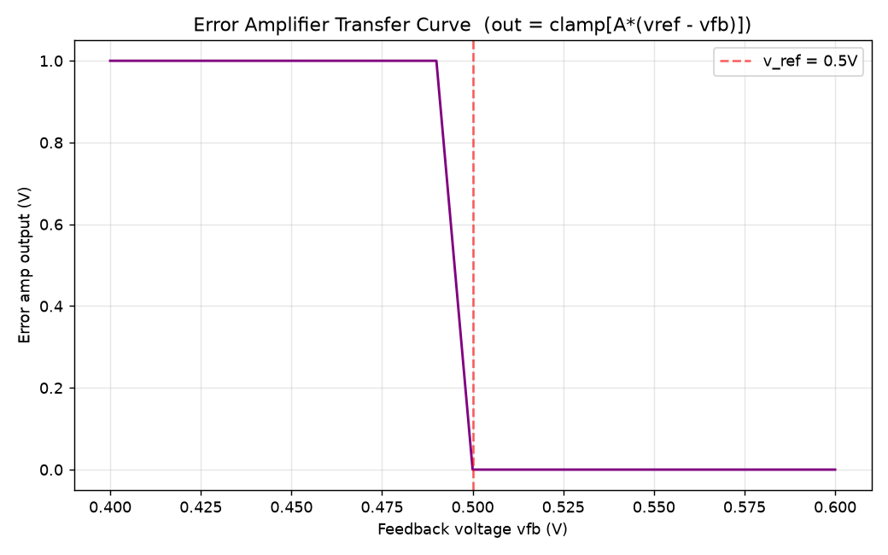
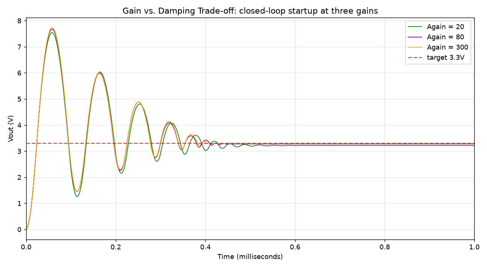

# Analog Control IC Blocks — Buck Converter

The analog half of the Digitally-Controlled Buck Converter with Custom Analog Control IC Blocks project. Built in SPICE (ngspice), these are the physical analog-circuit twins of the control operations done digitally in the Verilog controller (../rtl/).

## Architecture

A reference voltage is compared against the divided-down output by the error amplifier; its output drives a comparator against a ramp to make PWM; the PWM switches the power stage; the output feeds back. The loop finds its own duty cycle to hold V_out at 3.3 V.

## Each analog block is a digital op made physical

| Verilog (digital) | Analog IC block | Netlist |
|---|---|---|
| counter 0-255 sweep | Ramp generator | cir/ramp_generator.cir |
| counter < duty | Comparator | cir/comparator_pwm.cir |
| error = v_ref - v_out + gain | Error amplifier | cir/error_amp.cir |
| fixed v_ref = 3300 | Reference voltage | in loop netlists |
| whole loop (buck_top.v) | Closed-loop controller | cir/closed_loop.cir |

## The blocks

### 1. Ramp generator — twin of the digital counter
A constant 0.5 mA current charges a 1 nF capacitor, giving a linear ramp (V = I*t/C). A switch resets it every 2 us (500 kHz). Output: a clean 0 to 1 V sawtooth.

### 2. Comparator — twin of counter < duty
Output is HIGH while ramp < control voltage. The pulse turns off where the ramp crosses the control line. Higher control voltage = wider pulse = higher duty.

### 3. Error amplifier — twin of error = v_ref - v_out
Computes clamp of A*(v_ref - v_fb), gain A=100, clamped 0-1 V. Just 10 mV of input difference swings the full output range. The downward slope is the negative feedback that makes regulation stable.

## Closed-loop results

### Regulation — the loop finds its own duty
All blocks wired together with a feedback divider (V_out / 6.6). With only a 0.5 V reference set, the loop discovers the duty cycle that holds V_out at 3.277 V — no duty is ever specified by hand.

### Gain vs damping trade-off
Same loop at three gains. Higher gain = faster but rings harder; lower gain = smoother but slower with more steady-state error.

### Disturbance rejection — matches the Verilog exactly
Input supply sags 12 V to 9 V mid-run. Output holds 3.3 V (moves only 7 mV) while duty rises 0.276 to 0.367 to compensate. Same result as the Verilog half: 70/256 to 94/256 = 0.367 = 3.3/9. Both designs obey V_out = D * V_in.

### Soft-start — eliminates startup overshoot
Ramping the reference up over 1 ms keeps the error small throughout startup. Overshoot drops from 7.6 V to 3.286 V (130% to under 1%).

## Folder layout

analog/ has cir/ (netlists), py/ (plot scripts), data/ (output txt), plots/ (figures).

## Tools
ngspice 45.2 plus Python (numpy, matplotlib).

## Relationship to the digital half
../rtl/ proves the digital control loop in Verilog. These blocks prove the analog control loop in SPICE. Together they are the full mixed-signal design named in the project title.
